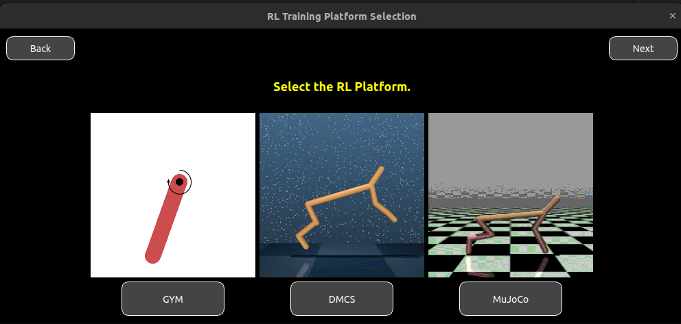
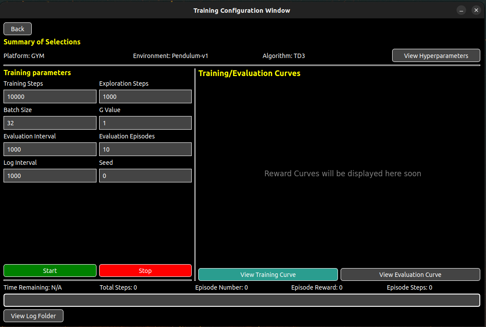

<h1 align="center">
  <br>
ReinforceUI <Studio></Studio>
  <br>
</h1>

<p align="center">
  <a href="https://github.com/dvalenciar/ReinforceUI-Studio/actions">
    
  </a>
  <a href="https://opensource.org/licenses/MIT">
    
  </a>
  <a href="https://pypi.org/project/ReinforceUI/">
    
  </a>
</p>

ReinforceUI Studio is a Python-based application designed to simplify the configuration and monitoring of Reinforcement Learning (RL) training processes. Featuring an intuitive graphical user interface (GUI) built with PyQt5, it eliminates the hassle of managing extra repositories or memorizing complex command lines.
Everything you need to train your RL model is provided in one repository. With just a few clicks, you can train your model, visualize the training process, and save the model for later use—ready to be deployed and analyzed.

<p align="center">
  
</p>

## Table of Contents
- [Why You Should Use ReinforceUI Studio](#why-you-should-use-reinforceui-studio)
- [Key Features of ReinforceUI Studio](#key-features-of-reinforceui-studio)
- [Installation](#installation)
  - [Clone and Run Locally](#installation---clone-and-run-locally)
  - [Set Up in a Conda Environment](#installation---set-up-in-a-conda-environment)
  - [Conda Environment with environment.yml File](#installation---conda-environment-with-environmentyml-file)
  - [Virtual Python Environment](#installation---virtual-python-environment)
  - [Run with Docker](#installation---run-with-docker)
- [Getting Started](#getting-started)
- [Limitations](#limitations-of-reinforceui-studio)
- [Contributing](#contributing-to-reinforceui-studio)
- [Citation](#citation)
- [License](#license)

# Why you should use ReinforceUI Studio
ReinforceUI Studio is built to streamline and enhance RL workflows, making it the go-to tool for RL practitioners and researchers. Here's why:

1. Intuitive Interface: The PyQt5-powered GUI removes the need for command-line interactions, ensuring accessibility for users of all skill levels.

2. Flexible Environment Selection: Easily choose from popular RL environments like MuJoCo, OpenAI Gym, and DeepMind Control Suite, allowing you to explore a wide range of benchmarks.

3. Customizable Training Parameters: Configure hyperparameters and algorithms with ease, or rely on default settings to get started quickly.

4. Real-Time Monitoring: Monitor training performance metrics as they happen, enabling quick insights and troubleshooting.

5. Comprehensive Logging: Automatically log training data, evaluation results, curve plots, and models. This feature simplifies analysis, comparisons, and refinement of your experiments.

6. Save Time and Effort: Focus on what matters—building and testing RL models—while ReinforceUI Studio handles the rest.

## Key Features of ReinforceUI Studio
- Select RL environments and popular algorithms.
- Customize training parameters or use optimized default configurations.
- Visualize real-time training performance metrics.
- Train, evaluate, and test RL policies with ease.
- Log training data, evaluation results, curve plots, models and videos automatically.
- Supports widely used RL environments like MuJoCo, [OpenAI Gymnasium](https://github.com/Farama-Foundation/Gymnasium?tab=readme-ov-file), and [DeepMind Control Suite](https://github.com/google-deepmind/dm_control).


<p align="center">
  
</p>


## Installation
ReinforceUI Studio offers several ways to get started, allowing you to choose the method that best suits your setup:

- Clone and run locally.
- Set up in a Conda environment or yaml file.
- Use a virtual Python environment. 
- Run with Docker.


### Installation -> Clone and Run Locally
Running locally means setting up ReinforceUI Studio directly on your machine. This method is ideal for users who prefer 
full control over the application and its dependencies. With just a few commands, you can have everything configured and
ready to go, no extra tools required.

1. Clone the repository:
```bash
git clone git@github.com:dvalenciar/ReinforceUI-Studio.git
cd ReinforceUI-Studio
pip install -r requirements.txt
```

2. Run the application:
```
python main.py
```

Easy as that! You're now ready to start training your RL models with ReinforceUI Studio.

### Installation -> Set Up in a Conda Environment
Conda is a widely used package manager that simplifies dependency management and ensures compatibility across platforms.
This method is ideal for users who want a clean, isolated environment without conflicts with other Python libraries or 
system configurations. Ensure Conda is installed on your system before proceeding. 
You can find Conda installation instructions [Conda Installation](https://docs.conda.io/projects/conda/en/latest/user-guide/install/linux.html).

1. Create a new Conda environment:
```bash
conda create -n reinforceui python=3.10
conda activate reinforceui
```

2. Clone the repository:
```bash
git clone git@github.com:dvalenciar/ReinforceUI-Studio.git
cd ReinforceUI-Studio
pip install -r requirements.txt
```

3. Run the application:
```bash
python main.py
```
You're all set! ReinforceUI Studio is now installed and ready to use in your Conda environment.

### Installation -> Conda Environment with **environment.yml** file (need to do)
Another easy way to install ReinforceUI Studio in a Conda environment is to use the provided `environment.yml` file.
This file contains all the dependencies required to run the application, making the installation process even simpler.

1. Clone the repository:
```bash
git clone git@github.com:dvalenciar/ReinforceUI-Studio.git
cd ReinforceUI-Studio
```
2. Create a new Conda environment using the `environment.yml` file:
```bash
conda env create -f environment.yml
```
3. Activate the Conda environment:
```bash
conda activate reinforceui
```
4. Run the application:
```bash
python main.py
```

All done! You can now use ReinforceUI Studio. 

### Installation -> Virtual Python Environment
If you do not like Conda, a virtual Python environment is another option for installing ReinforceUI Studio.
A virtual Python environment is an isolated setup that allows you to manage project dependencies without affecting your system’s Python or other projects. It's ideal for users who prefer lightweight setups without additional package managers like Conda.

1. Create a new virtual Python environment:
```
python3 -m venv reinforceui
source reinforceui/bin/activate
```

2. Clone the repository:
```
git clone git@github.com:dvalenciar/ReinforceUI-Studio.git
cd ReinforceUI-Studio
```

3. Install the required dependencies:
```
pip install -r requirements.txt
```

4. Run the application:
```
python main.py
```

That's it! You're now ready to use ReinforceUI Studio in your virtual Python environment.

### Installation -> Run with Docker (todo this)
Docker is a popular containerization tool that simplifies the deployment of applications across different platforms. 
This method is perfect for users who want a hassle-free, isolated setup without worrying about managing dependencies or
system configurations. Make sure Docker is installed on your system before proceeding. You can find Docker installation instructions [Docker Installation](https://docs.docker.com/get-docker/).
To make it even easier, we have already provided a pre-built image on Docker Hub.

1. Pull the ReinforceUI Studio Docker image:
```
docker pull dvr/reinforceui-studio
```

2. Run the Docker container:
```
docker run -it dvr/reinforceui-studio
```

3. Inside the docker container, run the application: (todo double check this)
```
cd ReinforceUI-Studio
python main.py
```

You're all set! ReinforceUI Studio is now running in a Docker container. 


## Getting Started
Getting started with ReinforceUI Studio is simple and straightforward. After run `python main.py`
Follow these easy steps:

1. Launch the Application:
Upon opening the app, you’ll be greeted with a welcoming window to begin your journey.

2. Select Your RL Platform:
Choose from popular Reinforcement Learning platforms like Gymnasium, DeepMind Control Suite (DMCS), or MuJoCo.

3. Choose Your Environment:
Select the specific environment from a list of available options tailored to your chosen platform.

4. Pick Your Algorithm:
Select the algorithm you want to use for training your model. Choose from a variety of popular algorithms like SAC, TD3, TQC and more.

5. Configure Training Parameters:
Customize your training parameters or use the default settings to get started quickly.

6. Hit "Start" to begin the training process.

7. Visualize Progress:
Watch real-time training and evaluation curves to track your model’s performance.

And that’s it! You’re ready to train your model

<p align="center">
  
</p>

When the training process is complete, ReinforceUI Studio will automatically save all you need.
We will save the models, log training data, and evaluate your model’s performance and provide a final video with the model's performance. 

## Limitations of ReinforceUI Studio. 
ReinforceUI Studio is designed to simplify the training and monitoring of RL models, but for environments and algorithms for **CONTINUOUS ACTION SPACE** only. 
Which this means? So it is not suitable for  environments such as Atari games or discrete control tasks and algorithms like DQN.

Why we have this limitation? Because these days robotics and many other real-world applications are using continuous action space environments and algorithms.
So we keep our focus on this area.

## Contributing to ReinforceUI Studio
We welcome contributions to ReinforceUI Studio! Whether it’s bug fixes, feature suggestions, or documentation improvements, your input is valuable. Here’s how you can get involved:

1. Report Issues: Found a bug or have a suggestion? Open an issue in the repository, and we’ll take a look.
2. Fork the Repository: Clone the project and make your changes in a new branch.
3. Submit a Pull Request: Once your changes are ready, create a pull request with a clear description of your updates.
4. Join Discussions: Check the Discussions tab to connect with other contributors and share your ideas.

## Citation
If you find ReinforceUI Studio useful for your research or project, please kindly star this repo and cite is as follows:

```
@misc{reinforce_ui_studio_2025,
  title = { ReinforceUI Studio: Simplifying Reinforcement Learning Training and Monitoring},
  author = {David Valencia Redrovan},
  year = {2025},
  publisher = {GitHub},
  url = {https://github.com/dvalenciar/ReinforceUI-Studio.}
}
```

## License
ReinforceUI Studio is licensed under the MIT License. You are free to use, modify, and distribute this software, 
provided that the original copyright notice and license are included in any copies or substantial portions of the software.

