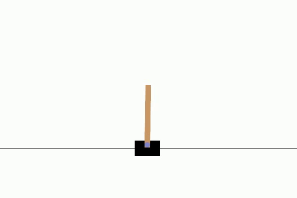

<h1 align="center">
  <br>
ReinforceUI Studio
  <br>
</h1>

<p align="center">
  <a href="https://github.com/dvalenciar/ReinforceUI-Studio/actions">
    
  </a>

  <a href="https://github.com/dvalenciar/ReinforceUI-Studio/actions">
    
  </a>

  <a href="https://github.com/dvalenciar/ReinforceUI-Studio/actions/workflows/formatting.yml">
    
  </a>
  
  <a href="https://docs.reinforceui-studio.com/">
    
  </a>
  
  <a href="https://opensource.org/licenses/MIT">
    
  </a>
  <a href="https://www.python.org/downloads/release/python-310/">
    
  </a>

</p>

ReinforceUI Studio is a Python-based application designed to simplify the configuration and monitoring of Reinforcement Learning (RL) training processes. Featuring an intuitive graphical user interface (GUI), it eliminates the hassle of managing extra repositories or memorizing complex command lines.

Everything you need to train your RL model is provided in one repository. With just a few clicks, you can train your model, visualize the training process, and save the model for later use—ready to be deployed and analyzed.


Please check out our **full documentation** available [here](https://docs.reinforceui-studio.com) for installation instructions, tutorials, RL concepts, and more.


<p align="center">
  
</p>

# Supported Algorithms
ReinforceUI Studio supports the following algorithms:

| Algorithm | Description |
| --- | --- |
| CTD4 | Continuous Distributional Actor-Critic Agent with a Kalman Fusion of Multiple Critics |
| DDPG | Deep Deterministic Policy Gradient |
| DQN | Deep Q-Network |
| PPO | Proximal Policy Optimization |
| SAC | Soft Actor-Critic |
| TD3 | Twin Delayed Deep Deterministic Policy Gradient |
| TQC | Controlling Overestimation Bias with Truncated Mixture of Continuous Distributional Quantile Critics |


# Why you should use ReinforceUI Studio
1. Simplified RL Workflows: The intuitive GUI eliminates the need for complex command-line operations
2. Environment Support: Seamlessly integrates with MuJoCo, OpenAI Gymnasium, and DeepMind Control Suite.
3. Algorithm Customization: Adjust hyperparameters and algorithms or use optimized defaults for quick experiments.
4. Real-Time Monitoring Dashboard: View training progress, metrics, and performance curves as they happen.
5. Comprehensive Data Logging: Automatically capture training data, evaluation results, plots, models, and videos for easy post-training analysis.
6. User-Friendly Training and Testing: Train, evaluate, and refine RL policies through a streamlined and intuitive workflow.

Check out our [video tutorial](https://www.youtube.com/watch?v=itXyyttwZ1M), where we show you how ReinforceUI Studio works


## Results Examples
Below are some examples of results generated by ReinforceUI Studio, showcasing the evaluation curves along with snapshots of the policies in action.

| **Algorithm** | **Platform** | **Environment**    | **Curve**                                                       | **Video**                                                                                        |
|---------------|--------------|--------------------|-----------------------------------------------------------------|--------------------------------------------------------------------------------------------------|
| **SAC**       | DMCS         | Walker Walk        |         |        | 
| **TD3**       | MuJoCo       | HalfCheetah v5     |      |        |
| **CDT4**      | DMCS         | Ball in cup catch  |  |  | 
| **DQN**       | Gymnasium    | CartPole v1        |         |           | 


## Citation
If you find ReinforceUI Studio useful for your research or project, please kindly star this repo and cite is as follows:

```
@misc{reinforce_ui_studio_2025,
  title = { ReinforceUI Studio: Simplifying Reinforcement Learning Training and Monitoring},
  author = {David Valencia Redrovan},
  year = {2025},
  publisher = {GitHub},
  url = {https://github.com/dvalenciar/ReinforceUI-Studio.}
}
```

## License
ReinforceUI Studio is licensed under the MIT License. You are free to use, modify, and distribute this software, 
provided that the original copyright notice and license are included in any copies or substantial portions of the software.


### Acknowledgements
This project was inspired by the CARES Reinforcement Learning Package from the University of Auckland 
